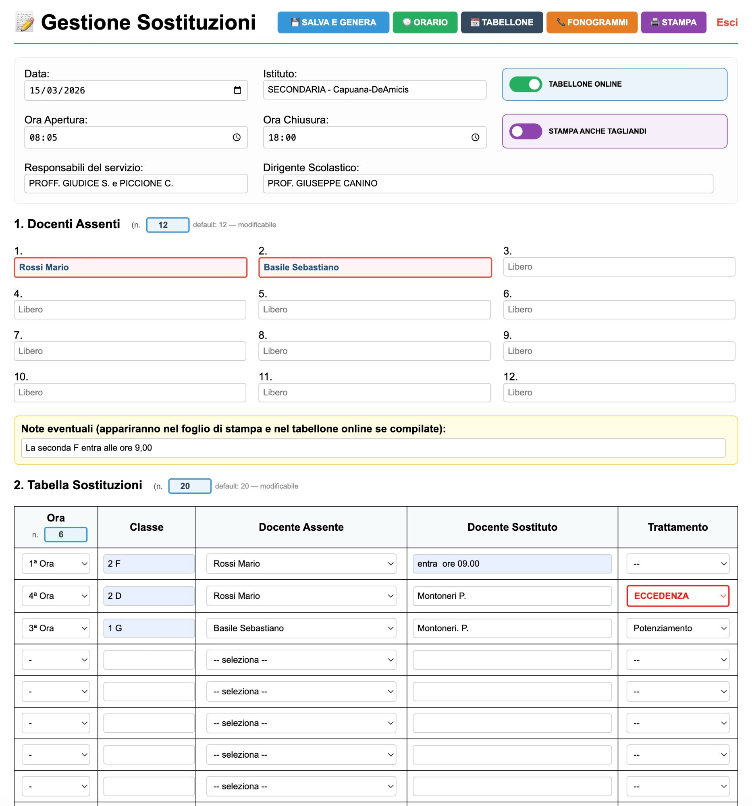
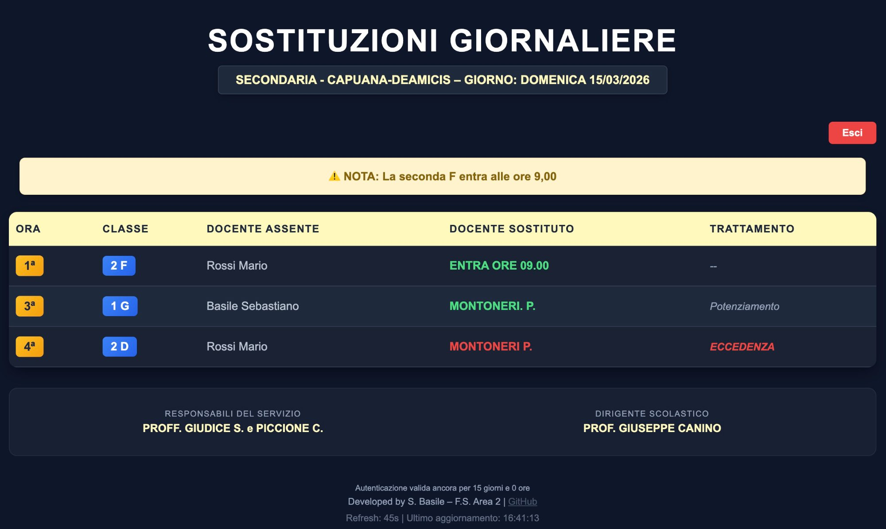
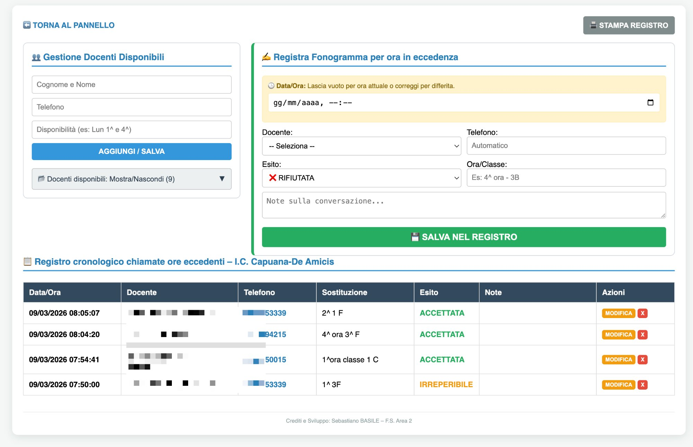
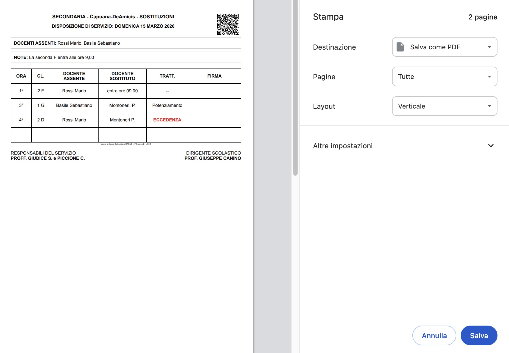

# 📋 Gestione Sostituzioni Docenti


**Applicativo web per la gestione quotidiana delle sostituzioni dei docenti assenti nelle scuole italiane.** Permette al personale di segreteria o alle funzioni strumentali di inserire, gestire e pubblicare il tabellone delle sostituzioni giornaliere, con funzioni aggiuntive per la registrazione dei fonogrammi e dei docenti disponibili.

---

Sviluppato da **Sebastiano Basile** — [superscuola.com](https://www.superscuola.com)

---

[](https://paypal.me/superscuola)

Se questo strumento ti è utile, puoi supportarne lo sviluppo con un piccolo contributo volontario. Grazie! ☕

---

## 🔗 Demo live
 
| Pagina | Link |
|---|---|
| 🔒 Pannello Admin | [superscuola.com/sostituzionicapuana](https://www.superscuola.com/sostituzionicapuana/) |
| 📺 Tabellone Docenti | [superscuola.com/sostituzionicapuana/tabellone.php](https://www.superscuola.com/sostituzionicapuana/tabellone.php) |
 
> Le demo sono quelle dell'installazione reale presso l'I.C. Capuana-De Amicis di Avola (SR). L'accesso è protetto da password.
 
---
 
## 📸 Anteprima
 
### Pannello di Amministrazione

 
### Tabellone Digitale Docenti

 
### Registro Fonogrammi ed Eccedenze

 
### Documento di Stampa con QR Code

 
---

## 📸 Funzionalità principali

| Funzione | Descrizione |
|---|---|
| 🗂️ **Pannello Admin** | Inserimento assenti, sostituti, trattamento (potenziamento, eccedenza, banca ore…) |
| 📺 **Tabellone digitale** | Visualizzazione pubblica o protetta da password, con auto-refresh |
| 📞 **Registro Fonogrammi** | Storico cronologico delle chiamate ai docenti disponibili |
| 👥 **Rubrica sostituti** | Elenco docenti disponibili con telefono e note sulle disponibilità |
| 📄 **Stampa PDF-ready** | Documento di servizio stampabile con QR-code e tagliandi individuali |
| 🔐 **Log degli accessi** | Registro di chi ha consultato il tabellone (IP, dispositivo, data/ora) |
| 🗄️ **Archivio storico** | I dati vengono salvati in file JSON per data, consultabili in qualsiasi momento |

---

## 🗂️ Struttura del progetto

```
gestione-sostituzioni/
│
├── index.php            # Pannello di amministrazione (accesso riservato)
├── tabellone.php        # Tabellone pubblico / protetto per i docenti
├── fonogrammi.php       # Registro fonogrammi ed eccedenze
├── admin_logs.php       # Visualizzazione log degli accessi al tabellone
│
└── archivio/            # Cartella dati (creata automaticamente)
    ├── sostituzioni_YYYY-MM-DD.json   # Dati per ogni giorno
    ├── registro_chiamate.json         # Storico fonogrammi
    ├── lista_disponibili.json         # Rubrica docenti disponibili
    └── accessi_log.txt                # Log degli accessi al tabellone
```

> ⚠️ La cartella `archivio/` viene creata automaticamente al primo salvataggio. Non è necessario crearla manualmente.

---

## ⚙️ Requisiti di sistema

- **PHP** 7.4 o superiore (consigliato PHP 8.x)
- **Web server**: Apache, Nginx o qualsiasi altro server compatibile con PHP
- **Moduli PHP necessari**: `json`, `session` (attivi per impostazione predefinita nella maggior parte delle installazioni)
- **HTTPS** consigliato (il file `tabellone.php` usa cookie con flag `secure: true`)
- **Permessi scrittura** sulla cartella `archivio/` (o permesso di crearla)

---

## 🚀 Installazione

### 1. Scarica i file

**Opzione A – GitHub (consigliato)**
```bash
git clone https://github.com/TUO-USERNAME/gestione-sostituzioni.git
```

**Opzione B – Download ZIP**  
Clicca su **Code → Download ZIP** e decomprimi i file.

---

### 2. Carica i file sul server

Copia i 4 file PHP nella cartella del tuo server web (es. `public_html/sostituzioni/` oppure `htdocs/sostituzioni/`).

```
public_html/
└── sostituzioni/
    ├── index.php
    ├── tabellone.php
    ├── fonogrammi.php
    └── admin_logs.php
```

---

### 3. Configura le password e i dati della scuola

Apri il file `index.php` con un editor di testo e modifica la sezione `$config` in cima al file:

```php
$config = [
    "password"        => "CAMBIA_QUESTA_PASSWORD",   // ← Password pannello admin
    "istituto_def"    => "NOME DEL TUO ISTITUTO",    // ← Nome scuola
    "dirigente_def"   => "PROF. NOME COGNOME",        // ← Dirigente Scolastico
    "resp_def"        => "PROF. NOME COGNOME",        // ← Responsabile del servizio
    "ora_apertura_def"=> "08:05",                     // ← Ora di apertura tabellone
    "ora_chiusura_def"=> "14:30",                     // ← Ora di chiusura tabellone
    "url_tabellone"   => "tabellone.php",             // ← URL tabellone (lascia invariato)
    "url_orario"      => "https://tuascuola.edu.it",  // ← Sito della scuola (per link)
    "credits"         => "A cura di: Nome Cognome",   // ← Crediti (puoi personalizzare)
    // ...
];
```

Poi apri `tabellone.php` e modifica la sezione `$config_tab`:

```php
$config_tab = [
    "usa_password"      => true,             // true = il tabellone richiede password
    "password_accesso"  => "CAMBIA_ANCHE_QUESTA",  // ← Password per i docenti
    "tempo_refresh"     => 45,               // Refresh automatico in secondi
    // ...
];
```

---

### 4. Permessi sulla cartella archivio

La cartella `archivio/` viene creata automaticamente dal codice. Se il tuo server non lo permette, creala manualmente e assegna i permessi di scrittura:

```bash
mkdir archivio
chmod 755 archivio
```

Se il server utilizza un utente PHP separato (es. `www-data`), potresti aver bisogno di:
```bash
chown www-data:www-data archivio
```

---

### 5. Verifica l'installazione

- Apri il browser e vai su: `https://tuodominio.it/sostituzioni/index.php`
- Inserisci la password che hai configurato
- Se vedi il pannello di gestione, l'installazione è riuscita! ✅

---

## 📖 Guida all'utilizzo

### Pannello Amministratore (`index.php`)

1. **Accedi** con la password impostata in `index.php`
2. **Seleziona la data** del giorno (di default è impostata a oggi)
3. Compila i campi:
   - **Docenti assenti**: inserisci i cognomi separati
   - **Tabella sostituzioni**: per ogni riga indica Ora, Classe, Docente Assente, Sostituto e Trattamento
   - **Note**: campo libero per comunicazioni aggiuntive
4. Spunta **"Pubblica online"** per rendere il tabellone visibile
5. Clicca **"Salva e Genera Documenti"**
6. Nella parte inferiore appare automaticamente il **documento di stampa** con QR code e, se abilitati, i **tagliandi individuali** per ogni sostituto

> 💡 Il numero di righe per assenti, sostituzioni e ore è configurabile direttamente nel pannello tramite i controlli numerici nelle intestazioni delle tabelle.

---

### Tabellone Docenti (`tabellone.php`)

- Accessibile da qualsiasi dispositivo (PC, tablet, smartphone)
- Si aggiorna automaticamente ogni N secondi (configurabile)
- Se protetto da password, i docenti inseriscono la loro password per visualizzare le sostituzioni; la sessione rimane attiva per **15 giorni** (cookie persistente)
- Fuori dall'orario configurato mostra un messaggio di "Servizio non attivo"

---

### Registro Fonogrammi (`fonogrammi.php`)

Accessibile solo dopo il login nel pannello admin. Permette di:

- **Gestire la rubrica** dei docenti disponibili per le sostituzioni (nome, telefono, note sulle disponibilità)
- **Registrare le chiamate** effettuate: docente contattato, ora/classe, esito (Accettata / Rifiutata / Irreperibile), note sulla conversazione
- **Stampare il registro** cronologico delle chiamate

---

### Log Accessi (`admin_logs.php`)

Accessibile solo dopo il login nel tabellone. Mostra:
- Quanti accessi per ogni giorno
- Ora e data di ogni accesso
- Indirizzo IP del dispositivo
- Tipo di dispositivo (iPhone, Android, iPad, PC)

---

## 🔧 Personalizzazione avanzata

### Opzioni di trattamento

Nel file `index.php`, modifica l'array `opzioni_tratt` per adattare i tipi di trattamento alla tua scuola:

```php
"opzioni_tratt" => ["--", "Potenziamento", "Servizio", "ECCEDENZA", "BANCA ORE", "Recupero", "Altro"],
```

### Numero massimo di righe

```php
"max_assenti" => 12,   // Righe tabella assenti
"max_sost"    => 20,   // Righe tabella sostituzioni
"max_ore"     => 6,    // Colonne ore
```

### Colori del tabellone

Nel file `tabellone.php`, personalizza la sezione `$config_tab`:

```php
"colore_sfondo"    => "#0f172a",   // Sfondo principale (blu scuro)
"colore_ora"       => "#fbbf24",   // Colore numero ora (giallo)
"colore_sostituto" => "#4ade80",   // Colore nome sostituto (verde)
"colore_eccedenza" => "#ef4444",   // Colore trattamento ECCEDENZA (rosso)
```

### Disattivare la password sul tabellone

Se vuoi un tabellone completamente pubblico, imposta in `tabellone.php`:

```php
"usa_password" => false,
```

### Pulizia archivio automatica

Dal pannello admin è disponibile il pulsante **"Pulisci Archivio (>30gg)"** che elimina i file JSON più vecchi di 30 giorni. Per automatizzare la pulizia, aggiungi un cron job sul server:

```bash
# Esempio: pulizia ogni domenica alle 2:00
0 2 * * 0 find /percorso/archivio/ -name "sostituzioni_*.json" -mtime +30 -delete
```

---

## 🔒 Sicurezza

> ⚠️ **Attenzione**: Le password sono attualmente in chiaro nei file di configurazione. Assicurati di:

- Usare password complesse e diverse per admin e tabellone
- Mantenere la cartella `archivio/` non navigabile (aggiungi un file `.htaccess`)
- Usare sempre **HTTPS** (obbligatorio per i cookie sicuri del tabellone)
- Non pubblicare i file `.json` dell'archivio su repository pubblici

### Proteggere la cartella archivio con .htaccess (Apache)

Crea un file `archivio/.htaccess` con questo contenuto:

```apache
Options -Indexes
Deny from all
```

Questo impedisce di navigare o accedere direttamente ai file JSON tramite browser.

---

## 🐛 Risoluzione problemi comuni

| Problema | Causa probabile | Soluzione |
|---|---|---|
| Pagina bianca | Errore PHP | Abilita la visualizzazione errori o controlla i log del server |
| Non salva i dati | Permessi sulla cartella `archivio/` | `chmod 755 archivio` o `chown www-data archivio` |
| Il tabellone non si aggiorna | Cache del browser | Svuota la cache o forza il refresh con Ctrl+F5 |
| Cookie non funzionano | Server senza HTTPS | Imposta `'secure' => false` in `tabellone.php` (solo per test locali) |
| QR code non appare | CDN non raggiungibile | Verifica la connessione internet del server |

---

## 📄 Licenza

Questo progetto è rilasciato sotto licenza **MIT**. Puoi usarlo, modificarlo e distribuirlo liberamente, anche in contesti scolastici e istituzionali, citando l'autore originale.

Vedi il file [LICENSE](LICENSE) per i dettagli completi.

---

## 👨‍💻 Autore

Sviluppato da **Sebastiano Basile** – Funzione Strumentale Area 2  
I.C. Capuana-De Amicis, Avola (SR)

Distribuito gratuitamente per uso scolastico.  
Se ti è stato utile, puoi offrire un contributo volontario:

[](https://paypal.me/superscuola)

---

## 🤝 Come contribuire

1. Fai un **Fork** del repository
2. Crea un branch per la tua modifica: `git checkout -b feature/nuova-funzione`
3. Esegui il commit: `git commit -m "Aggiunge nuova funzione"`
4. Fai il push: `git push origin feature/nuova-funzione`
5. Apri una **Pull Request**

---

## 📌 Changelog

### v1.0.0 (2026)
- Prima versione pubblica
- Pannello admin con gestione assenti e sostituzioni
- Tabellone digitale con password e cookie persistenti
- Registro fonogrammi ed eccedenze
- Rubrica docenti disponibili
- Log degli accessi
- Stampa con QR code e tagliandi individuali
- Pulizia automatica archivio
